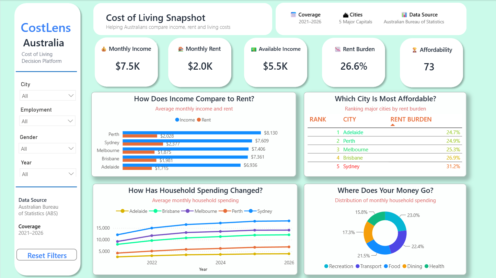
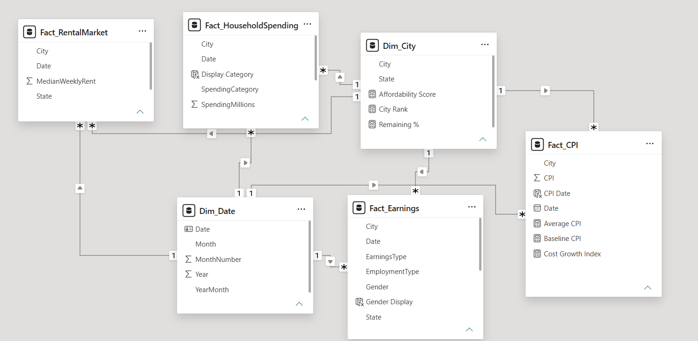

# 📊 CostLens Australia

### Cost of Living & Affordability Analytics | Power BI

CostLens Australia is an interactive Power BI decision-support dashboard designed to help users understand and compare income, rental costs, household spending and affordability across five major Australian capital cities.

The project transforms multiple economic and cost-of-living datasets into an intuitive analytical experience, allowing users to explore how income compares with living costs and identify differences in affordability between cities.

---

## 🖥️ Dashboard Preview



---

## 🎯 Business Problem

For international students, recent graduates and young professionals deciding where to live and build their careers in Australia, comparing cities based on salary or rent alone can be misleading. A city may offer higher average earnings, but those benefits can quickly be offset by higher rental costs and everyday household expenses.

For someone considering a move to Sydney, Melbourne, Brisbane, Adelaide or Perth, the more useful question is not simply **"Which city pays more?"** or **"Which city has cheaper rent?"**. It is **"Where will my income go further?"**

Answering that question is difficult because earnings, rental costs and household expenditure are reported separately across different datasets. This makes it challenging to understand the relationship between income and living costs, estimate how much income remains after rent, and compare the overall affordability of different cities.

**CostLens Australia** was developed to solve this problem by bringing these measures together into a single interactive Power BI decision-support dashboard. It enables users to compare earning potential against rental and household costs and develop a clearer picture of financial affordability across five major Australian capital cities.

### 👥 Target Users

The dashboard is designed primarily for:

- **International students** evaluating where to study, live and potentially begin their careers in Australia.
- **Recent graduates** comparing cities based on both employment income and the cost of establishing themselves independently.
- **Young professionals** considering relocation and wanting to understand whether higher earnings in another city translate into better financial affordability.
- **Individuals planning an interstate move** who want a simple, data-driven comparison of income and major living costs.

### 💡 Decisions the Dashboard Supports

CostLens helps users investigate practical questions such as:

- Which capital city has the lowest rental burden relative to average income?
- Do higher average earnings actually translate into more income remaining after rent?
- How much of monthly income is consumed by rental costs across different cities?
- Which city provides the strongest overall affordability position?
- How have household spending levels changed over time?
- Which household spending categories account for the largest share of expenditure?

By combining earnings, rental market and household spending data into comparable affordability indicators, CostLens transforms fragmented cost-of-living information into an accessible decision-support tool for people evaluating **where their income is likely to go further in Australia**.

## ⚙️ Power BI Development

The project was developed end-to-end in Power BI, covering data preparation, modelling, DAX development, visualisation and dashboard interaction design.

### 🗂️ Data Preparation & Modelling

- Integrated datasets covering earnings, rental costs, household expenditure and economic indicators.
- Prepared and transformed source data for reporting and analysis.
- Structured the data model to support analysis across city, year, gender and employment dimensions.
- Established relationships between fact and dimension tables to support consistent filtering across the dashboard.

#### 🔗 Data Model

The Power BI semantic model follows a fact-and-dimension structure, connecting core analytical datasets through shared City and Date dimensions.

- **Dim_City** provides consistent city-level filtering across the model.
- **Dim_Date** supports time-based analysis and year-level filtering.
- **Fact_Earnings** contains earnings data by city, employment type and gender.
- **Fact_RentalMarket** contains rental market data used for rent and affordability analysis.
- **Fact_HouseholdSpending** supports household expenditure and spending-category analysis.
- **Fact_CPI** provides CPI measures used to analyse changes in living costs.

The model uses one-to-many relationships between dimension and fact tables to maintain consistent filter propagation across dashboard measures and visuals.



### 🧮 DAX & KPI Development

Developed reusable DAX measures to calculate core affordability metrics and drive dynamic KPI cards, comparisons and city rankings across the dashboard.

#### 💰 Monthly Earnings

```DAX
Monthly Earnings =
[Weekly Earnings] * 52 / 12
```

Converts weekly earnings into a monthly equivalent, enabling direct comparison with monthly rental costs.

#### 🏠 Monthly Rent

```DAX
Monthly Rent =
AVERAGE(Fact_RentalMarket[MedianWeeklyRent]) * 52 / 12
```

Calculates average monthly rent by converting median weekly rental values from the rental market fact table.

#### 💵 Savings After Rent

```DAX
Savings After Rent =
[Monthly Earnings] - [Monthly Rent]
```

Calculates the amount of monthly earnings remaining after rental costs and powers the Available Income KPI.

#### 📉 Rent to Income %

```DAX
Rent to Income % =
DIVIDE([Monthly Rent], [Monthly Earnings])
```

Calculates the proportion of monthly earnings required to cover rent. This measure forms the core affordability ratio used throughout the dashboard.

#### 🏆 Affordability Score

```DAX
Affordability Score =
VAR RentBurden = [Rent to Income %]
RETURN
    IF(
        ISBLANK(RentBurden),
        BLANK(),
        MAX(
            0,
            MIN(
                100,
                100 - (RentBurden * 100)
            )
        )
    )
```

Transforms rent burden into an intuitive 0–100 affordability score, where a lower rental burden produces a higher affordability score. The measure handles blank values and constrains the result between 0 and 100.

#### 📊 City Rank

```DAX
City Rank =
RANKX(
    ALL(Dim_City[City]),
    [Rent to Income %],
    ,
    ASC,
    DENSE
)
```

Dynamically ranks cities by rent burden, assigning Rank 1 to the city with the lowest Rent to Income percentage. Dense ranking ensures consecutive ranking positions without gaps.

---

### 🔍 How the Measures Work Together

The DAX measures form a connected affordability calculation layer:

**Weekly Earnings → Monthly Earnings → Monthly Rent → Savings After Rent → Rent to Income % → Affordability Score → City Rank**

This measure-driven approach allows the dashboard KPIs, affordability rankings and comparative visuals to recalculate dynamically as users interact with City, Year, Gender and Employment filters.

### 📈 Dashboard Development

The dashboard includes:

- KPI cards for income, rent, available income, rent burden and affordability
- Income vs Rent comparison by city
- City affordability ranking
- Multi-year household spending trend analysis
- Household expenditure distribution
- Dynamic City, Employment, Gender and Year slicers
- Conditional formatting to highlight affordability differences

### 🖱️ Interactive Reporting & UX

The dashboard was designed as an interactive decision-support experience rather than a static report.

Key functionality includes:

- Cross-filtering between analytical visuals
- Dynamic KPI updates based on user selections
- Multi-select city filtering
- Interactive city selection through charts and ranking tables
- Independent master slicers for dashboard-level filtering
- Bookmark-driven Reset Filters functionality
- Consistent visual hierarchy, typography, spacing and dashboard styling

---

## 🗃️ Data Sources

The project uses Australian economic and cost-of-living data, including data sourced from the Australian Bureau of Statistics (ABS), covering the period **2021–2026**.

The analysis focuses on five major Australian capital cities:

📍 **Sydney | Melbourne | Brisbane | Adelaide | Perth**

---

## 💡 Key Insights

The dashboard enables users to quickly identify:

- Differences in rental burden between Australian capital cities
- Cities offering stronger relative affordability
- The relationship between average income and rental costs
- Changes in household expenditure over time
- Major household spending categories
- Differences in disposable income after key living costs

---

## 🛠️ Tools & Skills Demonstrated

**Power BI | DAX | Power Query | Data Modelling | Data Transformation | KPI Development | Data Visualisation | Dashboard Design | Interactive Reporting | Business Intelligence**

---

## 🚀 Project Purpose

CostLens Australia was developed as a Power BI portfolio project demonstrating the complete development lifecycle from raw data preparation and modelling through DAX development, analytical visualisation and interactive dashboard design.

The focus was not only on presenting data, but on building a usable decision-support tool that converts complex cost-of-living information into clear and actionable insights.
